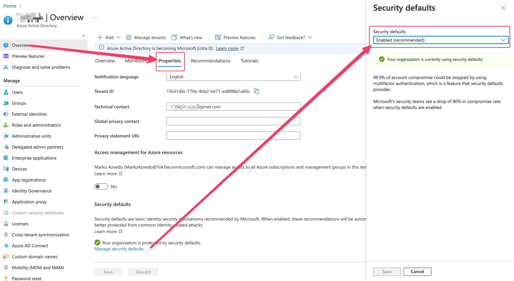
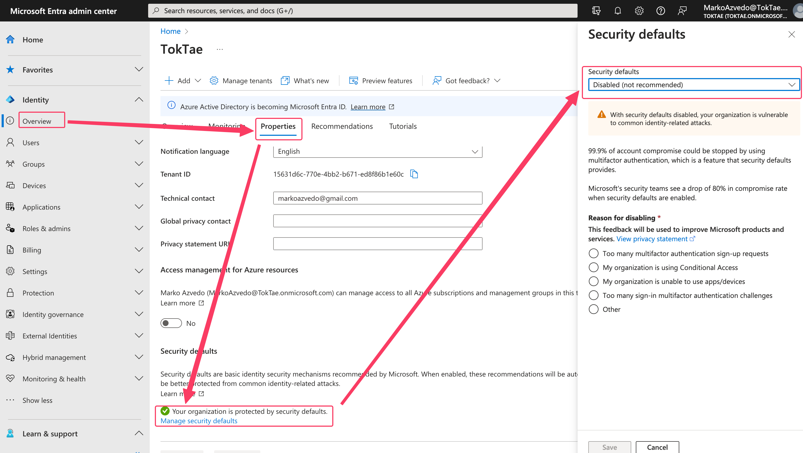
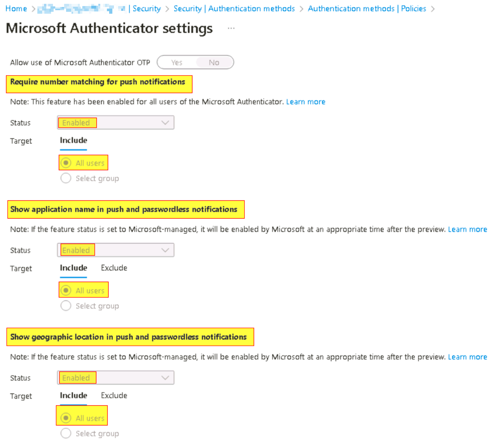
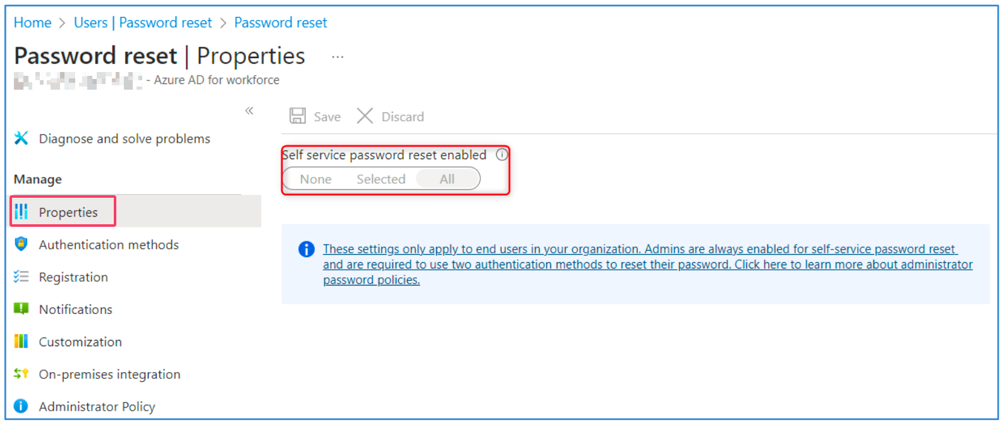
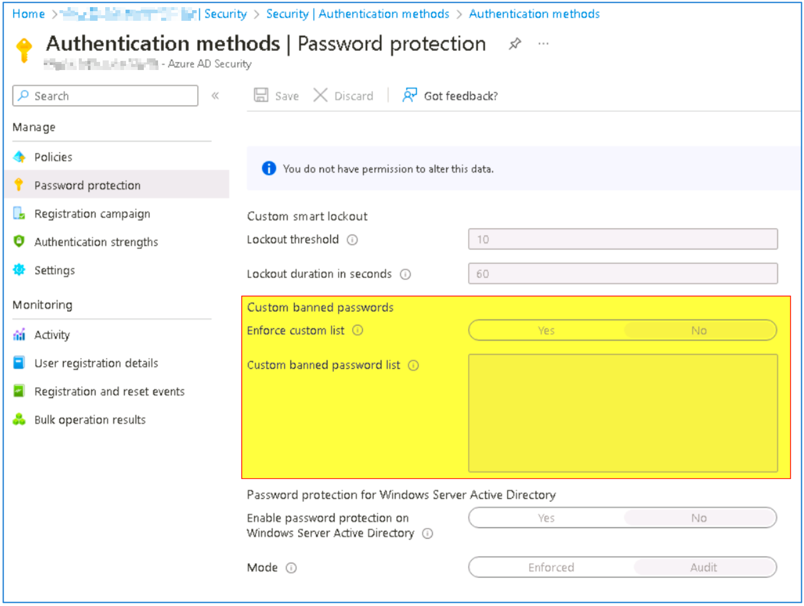
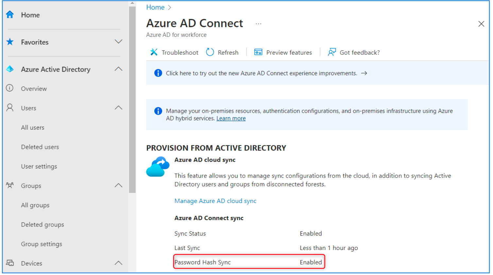
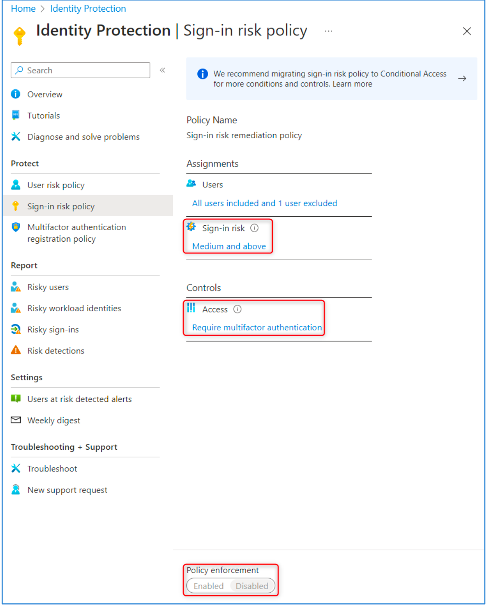
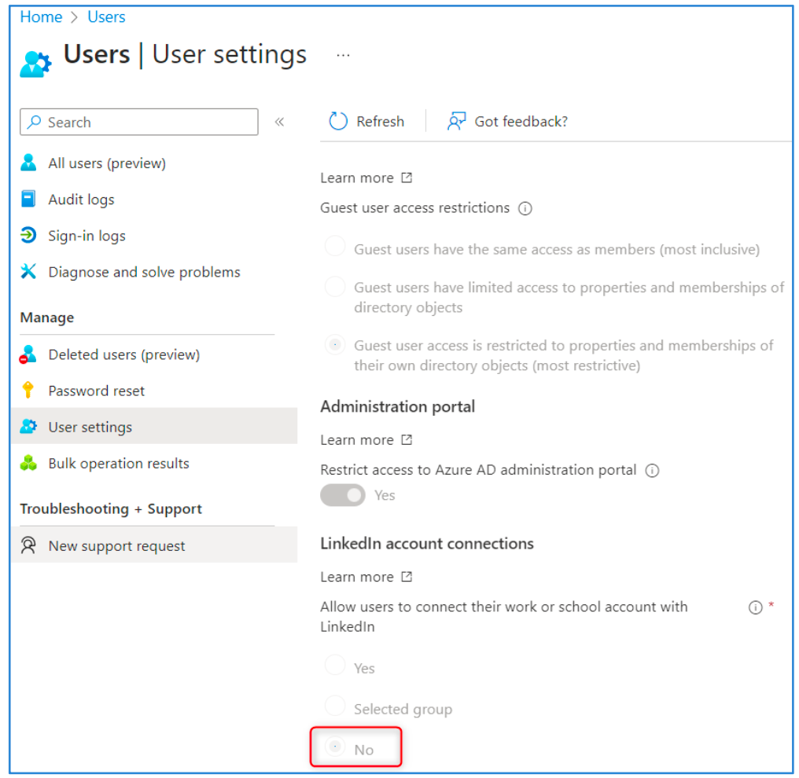
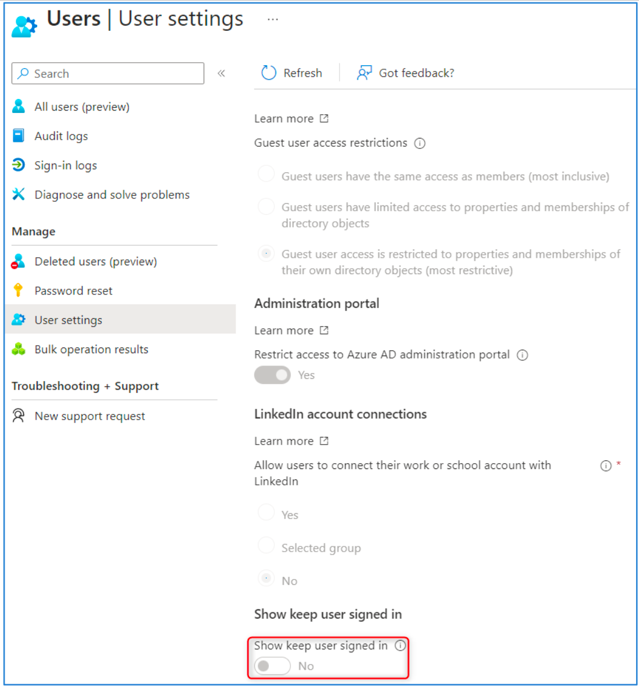
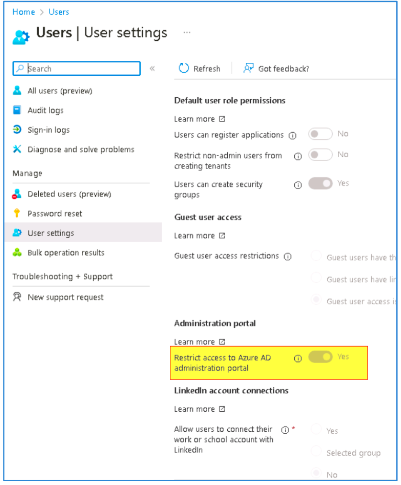

# Creation d'un tenant microsoft
## Pre-requis
## Ensure Security Defaults is disabled on Azure Active Directory
Par défaut, Microsoft active les paramètres de sécurité par défaut. L'objectif est de s'assurer que toutes les organisations disposent d'un niveau de sécurité de base.
Cependant, l'utilisation des paramètres de sécurité par défaut empêche l’application de paramètres personnalisés qui sont recommandés d’être définis dans ce benchmark.

> Portal Azure AD > Overview > Properties

{ width="800" }

> Microsoft Entra ID > Identity > Overview > Properties

{ width="800" }

## Ensure multifactor authentication is enabled for all users in administrative roles
Tous les comptes utilisateurs (administrateurs et utilisateurs standard) doivent avoir le MFA (Multi-Factor Authentication) activé. L’activation du MFA est primordiale pour assurer la sécurité de vos utilisateurs et données.

[Lien Dashboard M365 : Conditional Access - Microsoft Azure](https://portal.azure.com/#view/Microsoft_AAD_IAM/ConditionalAccessBlade/~/Policies)

## Ensure Sign-in frequency is enabled and browser sessions are not persistent for Administrative users.
Le fait de forcer un délai d'expiration pour les sessions administrateur permet de s'assurer que les sessions de navigateur
ne sont pas persistantes et permet de prévenir les attaques de type "drive-by" dans les navigateurs web, ce qui empêche également la création et l'enregistrement de cookies de session.

[Lien Dashboard M365 : https://aad.portal.azure.com/](https://aad.portal.azure.com/)

## Ensure multifactor authentication is enabled for all users in all roles
Tous les comptes utilisateurs (administrateurs et utilisateurs standards) doivent avoir le MFA (Multi-Factor Authentication) activé. L’activation du MFA est primordiale pour assurer la sécurité de vos utilisateurs et données.

[Lien Dashboard M365 : Conditional Access - Microsoft Azure](https://portal.azure.com/#view/Microsoft_AAD_IAM/ConditionalAccessBlade/~/Policies)

## Ensure Microsoft Authenticator is configured to protect against MFA fatigue
Les comptes utilisateurs doivent être protégés contre les attaques de type « MFA bombing ». Des précisions sur la localisation géographique de la requête, l’application ainsi que la nécessité d’entrer un nombre en plus du push MFA permettent à l’utilisateur de mieux vérifier une requête MFA.

{ width="800" }

## Ensure 'Phishing-resistant MFA strength' is required for Administrators
L’ « authentication strength » est un réglage du Conditional Access de Microsoft permettant de définir les méthodes d’authentification nécessaires à l’accès d’une ressource.
Ce réglage doit être paramétré pour tous les comptes administrateurs, selon l’une de ces 3 méthodes :

- FIDO2 Security Key
- Windows Hello for Business
- Certificate-based authentication (Multi-Factor)

## Ensure that between two and four global admins are designated
Microsoft recommande d’avoir moins de 5 Global Administrators.
Il faut utiliser les différents - et nombreux - rôles pour attribuer les permissions nécessaires aux administrateurs selon le principe de « Least Privilege ».

## Ensure self-service password reset is enabled
L'activation de la réinitialisation du mot de passe en libre-service permet aux utilisateurs de réinitialiser leurs propres mots de passe dans Azure AD.
Lorsque vos utilisateurs se connectent à Microsoft 365, ils sont invités à entrer des informations de contact supplémentaires qui les aideront à réinitialiser leur mot de passe à l'avenir.

> Portal Azure AD

{ width="800" }

## Ensure custom banned passwords lists are used
Ajouter une banlist de mots de passe communs permet de s’assurer que les utilisateurs choisissent un mot de passe qui, en plus de respecter les exigences de complexité standard, ne se trouve pas dans une liste des mots de passe les plus fréquemment utilisés.
Ces listes, communément appelées « Dictionnaires », sont disponibles publiquement sur Internet.
> Portal Azure AD

{ width="800" }

## Ensure password protection is enabled for on-prem Active Directory
Activer la protection par mot de passe Azure Active Directory à ActiveDirectory pour protéger contre l'utilisation de mots de passe courants.
Remarque : Cette recommandation s'applique uniquement aux déploiements hybrides et n'aura aucun impact sans un Active Directory on-premises.
> Portal Azure AD

{ width="800" }

## Enable Conditional Access policies to block legacy authentication
Les anciens protocoles qui ne permettent pas d’appliquer de sécurité (MFA) au moment de l’authentification présentent un important problème de sécurité vu que le MFA est bypassé.
Attention : Dès octobre 2022, Microsoft désactive petit à petit l’authentification legacy sur tous les tenants !

> il faut utiliser une CA

## Ensure that password hash sync is enabled for hybrid deployments

Activer la synchronisation des hashs des mots de passe afin de ne conserver qu’un mot de passe par utilisateur et permet de détecter le credential leak en identifiant si les mots de passe des comptes utilisateurs d'une organisation sont apparus sur le dark web ou dans des espaces publics.
Remarque : Cette recommandation s'applique uniquement aux déploiements hybrides et n'aura aucun impact sans un Active Directory on-premises.

> Microsoft Entra ID

{ width="800" }

## Enable Azure AD Identity Protection sign-in risk policies
Azure Active Directory Identity Protection sign-in risk détecte les risques en temps réel et hors ligne. Une ouverture de session à risque est un indicateur d'une tentative d'ouverture de session qui pourrait ne pas avoir été effectuée par le propriétaire légitime d'un compte utilisateur.
L'activation de la policy de risque d'ouverture de session garantit que les ouvertures de session suspectes font l'objet d'une demande d'authentification multi-facteur.

Activer les sign-in policies (de préférence depuis des règles de Conditional Access).

> Portal Auzre AD

{ width="800" }

## Enable Azure AD Identity Protection user risk policies
Lorsque la policy user-risk est activée, Azure AD détecte la probabilité qu'un compte utilisateur soit compromis. En tant qu'administrateur, vous pouvez configurer une policy d’accès conditionnel pour répondre automatiquement à un niveau de risque spécifique pour les utilisateurs. Par exemple, vous pouvez bloquer l'accès à vos ressources ou exiger un changement de mot de passe pour repasser un compte à un état « propre » (non risqué).

Activer les sign-in policies (de préférence depuis des règles de Conditional Access).

## Ensure 'Privileged Identity Management' is used to manage roles
La gestion des identités privilégiées Azure Active Directory peut être utilisée pour auditer les rôles, permettre l'activation « Just In Time » des rôles et permettre la revue périodique des rôles. Les organisations devraient retirer les membres permanents des rôles privilégiés d'Office 365 et, au contraire, les rendre éligibles par le biais d'un workflow d'activation Just In Time.

Les rôles sensibles suivants devraient être soumis au « Just In time » de manière systématique :

- Application Administrator
- Authentication Administrator
- Billing Administrator
- Cloud Application Administrator 
- Cloud Device Administrator 
- Compliance Administrator 
- Customer LockBox
- Access Approver
- Device Administrators
- Exchange Administrators
- Global Administrators
- HelpDesk Administrator
- Information Protection Administrator 
- Intune Service Administrator
- Kaizala Administrator
- License Administrator
- Password Administrator
- PowerBI Service Administrator 
- Privileged Authentication Administrator 
- Privileged Role Administrator
- Security Administrator
- SharePoint Service Administrator
- Skype for Business Administrator 
- Teams Service Administrator
- User Administrator

## Ensure that only organizationally managed/approved public groups exist
Microsoft 365 Groups permet de donner à un groupe de personnes l'accès à une collection de ressources partagées. Bien qu'il existe plusieurs types de groupes, cette recommandation concerne les groupes Microsoft 365. Dans le panneau d'administration, lorsqu'un groupe est créé, la valeur de confidentialité par défaut est "Public".
Un utilisateur peut ainsi accéder aux données de ce groupe :
- En utilisant le portail Azure et en s'ajoutant au groupe public
- En demandant l'accès au groupe à partir de l'application « Group »
- En accédant à l'URL SharePoint

[Lien Dashboard M365 : https://admin.microsoft.com/#/groups](https://admin.microsoft.com/#/groups)

Recomandations:

- S’assurer que tous les groupes paramétrés « publics » le sont à dessein et modifier la configuration de chaque groupe vers « privé » dans le cas contraire.
- Revoir périodiquement les groupes publics.

## Ensure that collaboration invitations are sent to allowed domains only
Les utilisateurs doivent pouvoir envoyer des invitations de collaboration uniquement aux domaines autorisés.
En spécifiant les domaines autorisés pour les collaborations, les externes sont explicitement identifiés. En outre, cela empêche les utilisateurs internes d'inviter des utilisateurs externes inconnus, tels que des comptes personnels, et de leur donner accès à des ressources.

[Lien Dashboard M365 : https://aad.portal.azure.com/](https://aad.portal.azure.com/#view/Microsoft_AAD_IAM/AllowlistPolicyBlade)

Recommandations:

- Déterminer une liste de domaines autorisés à l’invitation de guests.
- Revoir périodiquement la liste des domaines.

## Ensure 'LinkedIn account connections' is disabled
L'intégration avec LinkedIn doit être désactivée afin d'éviter les attaques par phishing.
Office 365 est la cible privilégiée des attaques par phishing. Les sites de réseaux sociaux ont rendu les attaques d'ingénierie sociale plus faciles à mener. L'intégration de LinkedIn est activée par défaut dans Office 365, ce qui pourrait conduire à un scénario à risque où des informations sensibles pourraient être exfiltrées par ce biais.

[Lien Dashboard M365 : https://aad.portal.azure.com/](https://aad.portal.azure.com/#view/Microsoft_AAD_UsersAndTenants/UserManagementMenuBlade/~/UserSettings)

> Portal Azure AD

{ width="800" }

## Ensure the option to remain signed in is hidden
Lorsque l’utilisateur peut choisir l’option de rester connecté, un token de persistance pouvant être valide jusqu’à 90 jours est créé, et ne prompte plus l’utilisateur ni à se connecter, ni à entrer un deuxième facteur.
Dans le cas où un utilisateur se connecte depuis une machine publiquement accessible, il serait trivial pour un attaquant d'accéder à toutes les données du cloud associées à ce compte.

[Lien Dashboard M365 : https://portal.azure.com/](https://portal.azure.com/#view/Microsoft_AAD_IAM/ActiveDirectoryMenuBlade/~/LoginTenantBranding)

{ width="800" }

## Ensure 'Restrict access to the Azure AD administration portal' is set to 'Yes'
Interdire aux utilisateurs non privilégiés de se connecter au portail Azure Active Directory.
Par défaut, un utilisateur final peut se connecter au portail AAD, et modifier par inadvertance des paramètres administrateur ou les paramètres du compte. En outre, un compte d'utilisateur final compromis pourrait être utilisé par un attaquant malveillant pour recueillir des informations supplémentaires et escalader une crise.
REMARQUE : Les utilisateurs pourront toujours se connecter au centre d'administration Azure Active Directory mais ne pourront pas consulter les informations du portail.

[Lien Dashboard M365 : https://portal.azure.com/](https://portal.azure.com/#view/Microsoft_AAD_IAM/ActiveDirectoryMenuBlade/~/LoginTenantBranding)

> Azure AAD portal

{ width="800" }

## Ensure 'Microsoft Azure Management' is limited to administrative roles
Microsoft Azure Management doit être limité à des rôles administratifs spécifiques prédéterminés, empêchant les utilisateurs non privilégiés de se connecter à la plupart des portails autres que Microsoft 365 Defender et Microsoft Purview.
L’application de ce paramètre impacte les services suivants : 

- Classic deployment model APIs
- Azure PowerShell
- Azure CLI
- Azure DevOps
- Azure Data Factory portal
- Azure Event Hubs
- Azure Service Bus
- Azure SQL Database
- SQL Managed Instance
- Azure Synapse
- Visual Studio subscriptions administrator portal
- Microsoft IoT Central