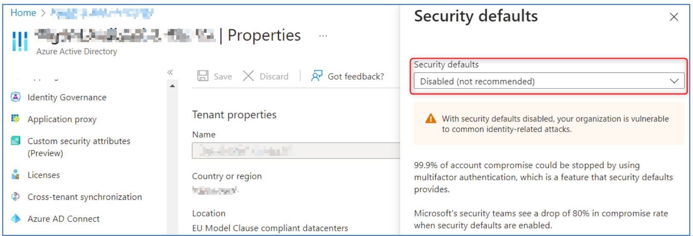

> ==Work In Progess !!==
## Account / Authentication
### 1.1.1 Ensure Security Defaults is disabled on Azure Active Directory
Description:

Par défaut, Microsoft active les paramètres de sécurité par défaut. L'objectif est de s'assurer que toutes les organisations disposent d'un niveau de sécurité de base.

Cependant, l'utilisation des paramètres de sécurité par défaut empêche l’application de paramètres personnalisés qui sont recommandés d’être définis dans ce benchmark.

Démonstration

### 1.1.2 Ensure multifactor authentication is enabled for all users in administrative roles
### 1.1.3 Ensure Sign-in frequency is enabled and browser sessions are not persistent for Administrative users.
### 1.1.4 Ensure multifactor authentication is enabled for all users in all roles
### 1.1.5 Ensure Microsoft Authenticator is configured to protect against MFA fatigue
### 1.1.6 Ensure 'Phishing-resistant MFA strength' is required for Administrators
### 1.1.7 Ensure that between two and four global admins are designated
### 1.1.8 Ensure self-service password reset is enabled
### 1.1.9 Ensure custom banned passwords lists are used
### 1.1.10 Ensure password protection is enabled for on-prem Active Directory
### 1.1.11 Enable Conditional Access policies to block legacy authentication
### 1.1.12 Ensure that password hash sync is enabled for hybrid deployments
### 1.1.13 Enable Azure AD Identity Protection sign-in risk policies
### 1.1.14 Enable Azure AD Identity Protection user risk policies
### 1.1.15 Ensure 'Privileged Identity Management' is used to manage roles
### 1.1.16 Ensure that only organizationally managed/approved public groups exist
### 1.1.17 Ensure that collaboration invitations are sent to allowed domains only
### 1.1.18 Ensure 'LinkedIn account connections' is disabled
### 1.1.19 Ensure the option to remain signed in is hidden
### 1.1.20 Ensure 'Restrict access to the Azure AD administration portal' is set to 'Yes'
### 1.1.21 Ensure 'Microsoft Azure Management' is limited to administrative roles
### 1.1.22 Ensure 'Restrict non-admin users from creating tenants' is set to 'Yes'
### 1.2 Ensure modern authentication for Exchange Online is enabled
### 1.3 Ensure modern authentication for SharePoint applications is required
### 1.4 Ensure the 'Password expiration policy' is set to 'Set passwords to never expire’
### 1.5 Ensure Administrative accounts are separate and cloud-only.
### 1.6 Ensure two emergency access accounts have been defined
### 1.7 Ensure 'Idle session timeout' is set to '1 hour (or less)' for unmanaged devices
### 1.N.1 MFA methods - Disable MFA via SMS and phone calls
### 1.N.2 Disable MFA “app passwords”
### 1.N.3 Restrict creation of M365 groups
### 1.N.4 Housekeeping - Delete unused groups
### 1.N.5 Don't allow guests to invite other guests

## Application Permissions
### 2.1 Ensure the admin consent workflow is enabled
### 2.2 Ensure third party integrated applications are not allowed.
### 2.3 Ensure 'External sharing' of calendars is not available
### 2.4 Ensure Safe Links for Office Applications is Enabled
### 2.5 Ensure Safe Attachments for SharePoint, OneDrive, and Microsoft Teams is Enabled
### 2.6 Ensure Office 365 SharePoint infected files are disallowed for download
### 2.7 Ensure user consent to apps accessing company data on their behalf is not allowed
### 2.8 Ensure users installing Outlook add-ins is not allowed
### 2.9 Ensure 'User owned apps and services' is restricted
### 2.10 Ensure internal phishing protection for Forms is enabled
### 2.11 Ensure that Sways cannot be shared with people outside of your organization
Description
Désactiver le partage externe d'éléments Sway (Microsoft Sway est un programme de présentation qui vous permet de créer des diaporamas, des lettres d'information, CV, blogs, etc.) tels que des rapports, des bulletins d'information, des présentations, etc. qui pourraient contenir des informations sensibles, afin d'éviter toute fuite de données accidentelle ou arbitraire.
Lien Dashboard M365 : https://admin.microsoft.com/#/Settings/Services/:/Settings/L1/Sway
### 2.12 Ensure SharePoint and OneDrive integration with Azure AD B2B is enabled
### 2.N.1 External sharing management
### 2.N.2 Do not automatically admit guests to Teams meetings
### 2.N.3 Do not allow guests to start a meeting
### 2.N.4 Contact by "private" users

## Data Management
### 3.1 Ensure the customer lockbox feature is enabled
### 3.2 Ensure SharePoint Online Information Protection policies are set up and used
### 3.3 Ensure 'external access' is restricted in the Teams admin center
### 3.4 Ensure DLP policies are enabled
### 3.5 Ensure DLP policies are enabled for Microsoft Teams
### 3.6 Ensure that SharePoint guest users cannot share items they don't own
### 3.7 Ensure external file sharing in Teams is enabled for only approved cloud storage services

## Email Security / Exchange Online
4.1 Ensure external file sharing in Teams is enabled for only approved cloud storage services
4.2 Ensure Exchange Online Spam Policies are set to notify administrators
4.3 Ensure all forms of mail forwarding are blocked and/or disabled
4.4 Ensure mail transport rules do not whitelist specific domains
4.5 Ensure Safe Attachments policy is enabled
4.6 Ensure that an anti-phishing policy has been created
4.7 Ensure that DKIM is enabled for all Exchange Online Domains
4.8 Ensure that SPF records are published for all Exchange Domains
4.9 Ensure DMARC Records for all Exchange Online domains are published
4.10 Ensure notifications for internal users sending malware is Enabled
4.11 Ensure MailTips are enabled for end users
4.12 Ensure Priority account protection is enabled and configured
4.13 Ensure Priority accounts have 'Strict protection' presets applied

## Auditing
5.1.1 Ensure 'Access reviews' for Guest Users are configured
5.1.2 Ensure 'Access reviews' for high privileged Azure AD roles are configured
5.2 Ensure Microsoft 365 audit log search is Enabled
5.3 Ensure mailbox auditing for all users is Enabled
5.4 Ensure the Azure AD 'Risky sign-ins' report is reviewed at least weekly
5.5 Ensure the Application Usage report is reviewed at least weekly
5.6 Ensure the self-service password reset activity report is reviewed at least weekly
5.7 Ensure user role group changes are reviewed at least weekly
5.8 Ensure mail forwarding rules are reviewed at least weekly
5.9 Ensure all security threats in the Threat protection status report are reviewed at least weekly
5.10 Ensure the Account Provisioning Activity report is reviewed at least weekly
5.11 Ensure non-global administrator role group assignments are reviewed at least weekly
5.12 Ensure the spoofed domains report is reviewed weekly
5.13 Ensure Microsoft Defender for Cloud Apps is enabled and configured
5.14 Ensure the 'Restricted entities' report is reviewed weekly
5.15 Ensure Guest Users are reviewed at least biweekly

## Storage
6.1 Ensure SharePoint external sharing is managed through domain whitelist/blacklists
6.2 Block OneDrive for Business sync from unmanaged devices
6.3 Ensure expiration time for external sharing links is set
6.4 Ensure 'third-party storage services' are restricted in 'Microsoft 365 on the web’
6.5 Ensure additional storage providers are restricted in Outlook on the web