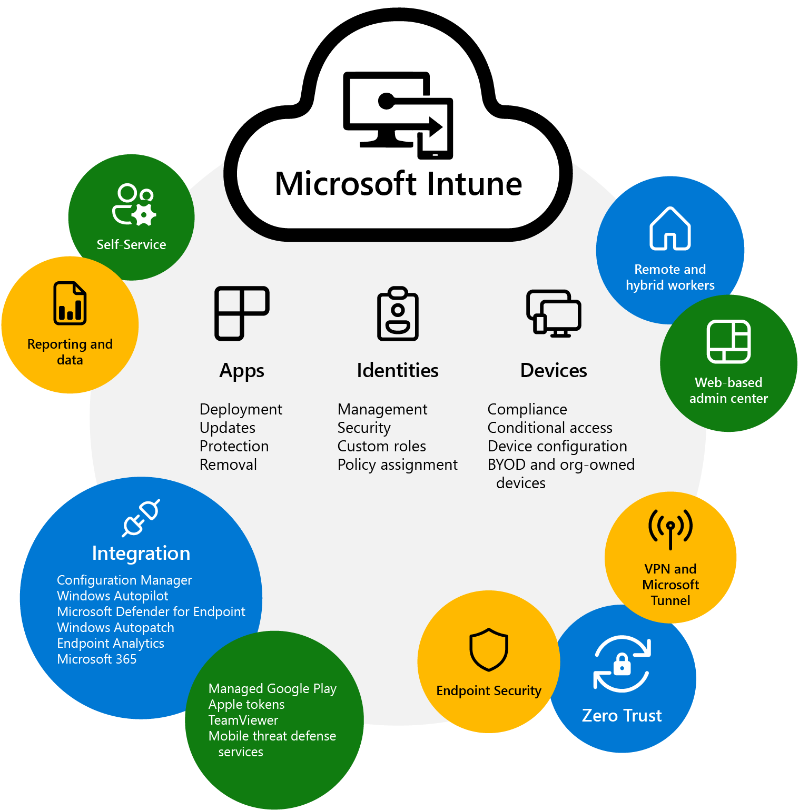

# What is Intune

## Manually register devices with Windows Autopilot
ALT + F10 on windows boot apres avoir selectionner la bonne langue de clavier
### Online status
```powershell
PowerShell.exe -ExecutionPolicy Bypass
Install-Script -name Get-WindowsAutopilotInfo -Force
Set-ExecutionPolicy -Scope Process -ExecutionPolicy RemoteSigned
Get-WindowsAutopilotInfo -Online
```
#### Resources:
- [Manually register devices with Windows Autopilot | Microsoft Learn](https://learn.microsoft.com/en-us/mem/autopilot/add-devices)
- [[Autopilote troubleshooting]]