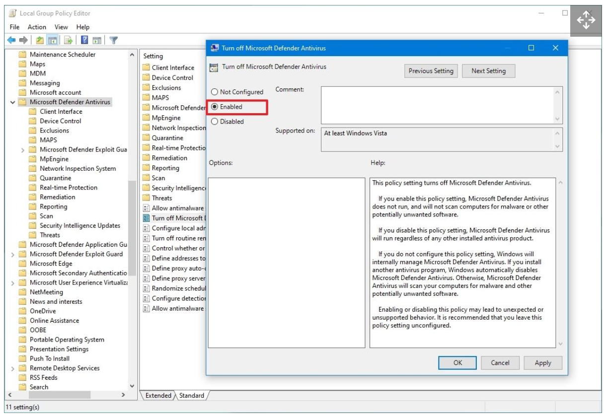

# Microsft Defender for Endpoints

1. Make sure "Turn Off Microsoft Defender" Policy is not activated (its a GPO). It should be set to NOT configured or Disabled
2. Onboarding
3. Active/Passive
4. Intelligence update

## Pre-requists
[Run the client analyzer on Windows](https://learn.microsoft.com/en-us/microsoft-365/security/defender-endpoint/run-analyzer-windows?view=o365-worldwide)

Direct connection
Proxy:
- Unauthenticated
- No TLS inspection

crl.microsoft.com
ctldl.microsoft.com
crl.microsoft.com
www.microsoft.com/pkiops/*
www.microsoft.com/pki/*
uk-v20.events.data.microsoft.com or *.events.data.microsoft.com

## Check if the device has already been already downloaded
Check if "Computer\HKEY_LOCAL_MACHINE\SOFTWARE\Microsoft\Windows Advanced Threat Protection" has subfolders


## Install the Windows Defender for Endpoint msi

## with GPO.
under Delegation > Advanced >
- Remove *Authenticated users* group
- Add the group contenning the servers wanted > and give *XXX group* READ and APPLY GROUP POLICY permission

## For Windows server 2012 and 2016

1. Download MDE installation packet (md4ws.msi) and onboarding script from Microsoft Security portal [MDE installation packet](https://security.microsoft.com)

2. [Download Microsoft helper script](https://github.com/microsoft/mdefordownlevelserver)

3. [Download latest MDE platform update](https://definitionupdates.microsoft.com/download/DefinitionUpdates/Platform/4.18.23050.5/x64/UpdatePlatform.exe)

4. Run helper script to onboard
```powershell
.\Install.ps1 -UI -OnboardingScript ".\WindowsDefenderATPOnboardingScript.cmd"
```

Pour le script onboarding il faut prendre la version pour les GPO car elle n'est pas interactive

## Disable MS Defender service
La désactivation de Windows Defender 2021 peut être effectuée en utilisant l’invite de commande (CMD). 
sc config WinDefend start=disabled

## Disable MS Defender par GPO

Browse the following path: Computer Configuration > Administrative Templates > Windows Components > Microsoft Defender Antivirus
Double-click the "Turn off Microsoft Defender Antivirus" policy.


## Add MDE tags on devices through GPO

Registry key : Computer\HKEY_LOCAL_MACHINE\SOFTWARE\Policies\Microsoft\Windows Advanced Threat Protection\DeviceTagging
Registry key value (REG_SZ) : Group
Registry key data : Servers

## Get Exclusions
```powershell
function Get-Exclusions {
    $Prefs = Get-MpPreference
    $Prefs.ExclusionExtension | ForEach-Object { [PSCustomObject]@{ Item = $_; Type = "Extension" } }
    $Prefs.ExclusionProcess | ForEach-Object { [PSCustomObject]@{ Item = $_; Type = "Process" } }
    $Prefs.ExclusionPath | ForEach-Object { [PSCustomObject]@{ Item = $_; Type = "Path" } }
    $Prefs.ExclusionIpAddress | ForEach-Object { [PSCustomObject]@{ Item = $_; Type = "IpAddress" } }
}

Get-Exclusions | ConvertTo-Csv -NoTypeInformation
```

## Get ASR Status
```powershell
<#
    Outputs Attack Surface Reduction rule status
#>

function Get-AttackSurfaceReductionRuleStatus {

    function Get-AsrStatus ($Value) {
        switch ($Value) {
            0 { "Disabled" }
            1 { "Enabled" }
            2 { "Audit" }
            default { "Not configured" }
        }
    }

    $Prefs = Get-MpPreference
    if ($null -eq $Prefs.AttackSurfaceReductionRules_Ids) {
        Write-Host "ASR rules not configured."
    }
    else {
        for ($i = 0; $i -le ($Prefs.AttackSurfaceReductionRules_Ids.Count - 1); $i++) {
            [PSCustomObject]@{
                RuleId = $Prefs.AttackSurfaceReductionRules_Ids[$i]
                Status = Get-AsrStatus -Value $Prefs.AttackSurfaceReductionRules_Actions[$i]
            }
        }
    }
}
```

## Check if Defender EDR is activated
### On servers SENSE must be started
When the SENSE service starts for the first time, it writes onboarding status to the registry location
```
HKLM\SOFTWARE\Microsoft\Windows Advanced Threat Protection\Status
SENSE service onboarding status isn't set to 1
```
Source: https://learn.microsoft.com/en-us/microsoft-365/security/defender-endpoint/troubleshoot-onboarding?view=o365-worldwide

## Verify client connectivity to Microsoft Defender for Endpoint service URLs
https://learn.microsoft.com/en-us/microsoft-365/security/defender-endpoint/configure-proxy-internet?view=o365-worldwide#verify-client-connectivity-to-microsoft-defender-for-endpoint-service-urls

## MDE commands

```powershell title="MDE change comands"
Set-MpPreference -DisableRealtimeMonitoring $false
Set-MpPreference -DisableIOAVProtection $false
New-Item -Path "HKLM:\SOFTWARE\Policies\Microsoft\Windows Defender" -Name "Real-Time Protection" -Force
New-ItemProperty -Path "HKLM:\SOFTWARE\Policies\Microsoft\Windows Defender\Real-Time Protection" -Name "DisableBehaviorMonitoring" -Value 0 -PropertyType DWORD -Force
New-ItemProperty -Path "HKLM:\SOFTWARE\Policies\Microsoft\Windows Defender\Real-Time Protection" -Name "DisableOnAccessProtection" -Value 0 -PropertyType DWORD -Force
New-ItemProperty -Path "HKLM:\SOFTWARE\Policies\Microsoft\Windows Defender\Real-Time Protection" -Name "DisableScanOnRealtimeEnable" -Value 0 -PropertyType DWORD -Force
New-ItemProperty -Path "HKLM:\SOFTWARE\Policies\Microsoft\Windows Defender" -Name "DisableAntiSpyware" -Value 0 -PropertyType DWORD -Force
start-service WinDefend
start-service WdNisSvc

New-Item -Path "HKLM:\SOFTWARE\Policies\Microsoft\Windows Defender" -Name "DisableAntiSpyware" -Force -Value 1 -PropertyType DWORD -Force
New-ItemProperty -Path "HKLM:\SOFTWARE\Policies\Microsoft\Windows Defender\DisableAntiSpyware" -Name "DisableBehaviorMonitoring" -Value 0 -PropertyType DWORD -Force

Remove-ItemProperty -Path "HKLM:\SOFTWARE\Policies\Microsoft\Windows Defender" -Name "DisableAntiSpyware" -Force
```

````powershell title="MDE PowerShell Commands:" 
get-mpcomputerstatus
get-mpthreat
get-mpthreatdetection
Set-MpPreference -DisableRealtimeMonitoring $true
Add-MpPreference -ExclusionPath "c:\ADAMDEMO"
Update-mpsignature
Start-mpscan 
```