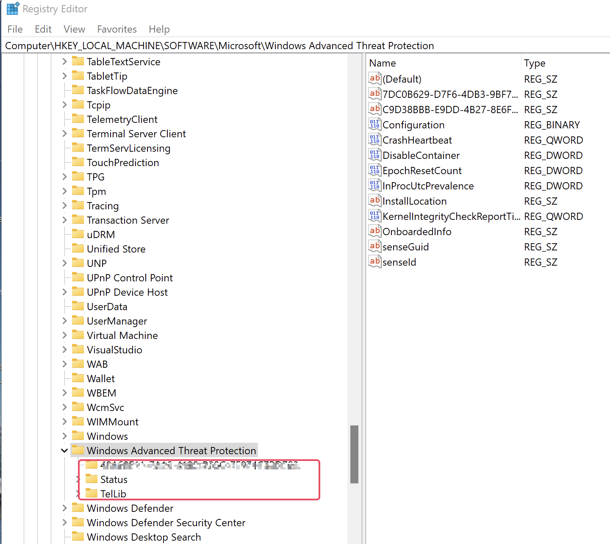

# Microsft Defender for Endpoints

1. Make sure "Turn Off Microsoft Defender" Policy is not activated (its a GPO). It should be set to NOT configured or Disabled
2. Onboarding
3. Active/Passive
4. Intelligence update

## Pre-requists
[Run the client analyzer on Windows](https://learn.microsoft.com/en-us/microsoft-365/security/defender-endpoint/run-analyzer-windows?view=o365-worldwide)

Direct connection
Proxy:
- Unauthenticated
- No TLS inspection

crl.microsoft.com
ctldl.microsoft.com
crl.microsoft.com
www.microsoft.com/pkiops/*
www.microsoft.com/pki/*
uk-v20.events.data.microsoft.com or *.events.data.microsoft.com

## Check if the device has already been already downloaded
Check if "Computer\HKEY_LOCAL_MACHINE\SOFTWARE\Microsoft\Windows Advanced Threat Protection" has subfolders

## Install the Windows Defender for Endpoint msi

## with GPO.
under Delegation > Advanced >
- Remove *Authenticated users* group
- Add the group contenning the servers wanted > and give *XXX group* READ and APPLY GROUP POLICY permission

## For Windows server 2012 and 2016

1. Download MDE installation packet (md4ws.msi) and onboarding script from Microsoft Security portal [MDE installation packet](https://security.microsoft.com)

2. [Download Microsoft helper script](https://github.com/microsoft/mdefordownlevelserver)

3. [Download latest MDE platform update](https://definitionupdates.microsoft.com/download/DefinitionUpdates/Platform/4.18.23050.5/x64/UpdatePlatform.exe)

4. Run helper script to onboard
.\Install.ps1 -UI -OnboardingScript ".\WindowsDefenderATPOnboardingScript.cmd"

Pour le script onboarding il faut prendre la version pour les GPO car elle n'est pas interactive

## Disable MS Defender service
La désactivation de Windows Defender 2021 peut être effectuée en utilisant l’invite de commande (CMD). 
sc config WinDefend start=disabled

## Disable MS Defender par GPO

Browse the following path: Computer Configuration > Administrative Templates > Windows Components > Microsoft Defender Antivirus
Double-click the "Turn off Microsoft Defender Antivirus" policy.

