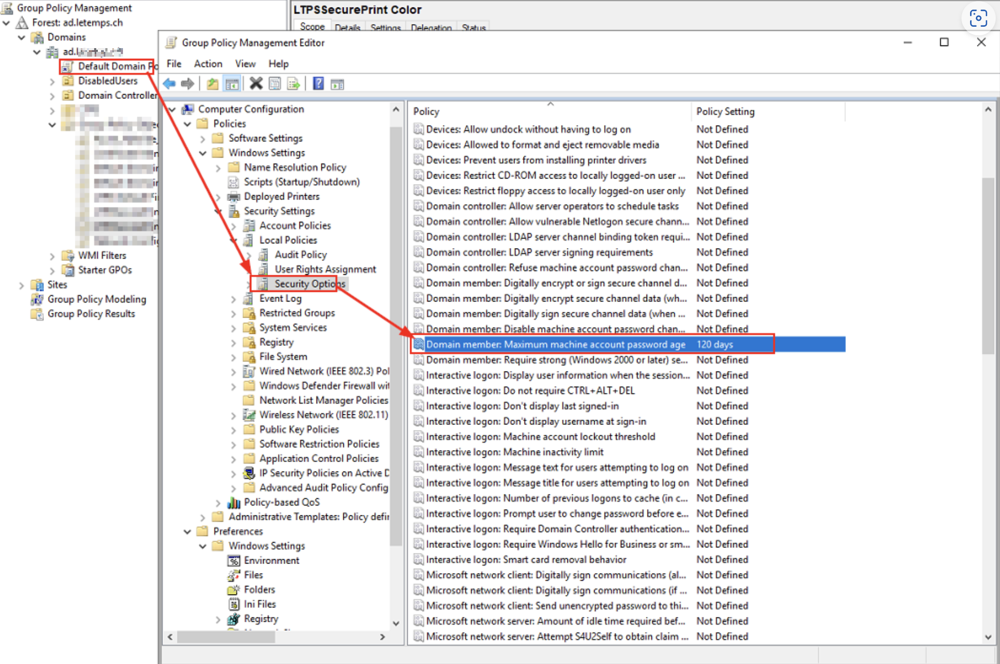
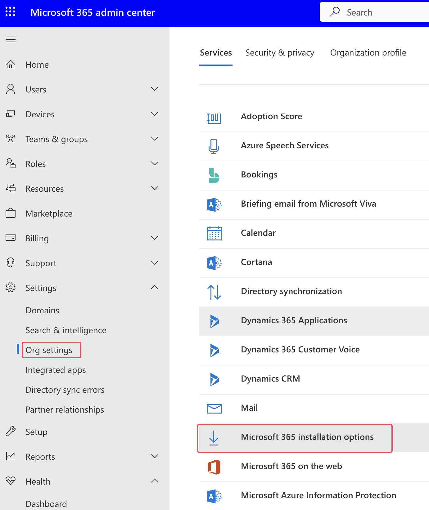

# Tips & Tricks

## GPOs
### View Applied Policies with the Command Prompt
```cmd
gpresult /r
```
```cmd title="User scope"
gpresult /User xxx /v
```
```cmd title="Save results to a file"
gpresult /R > c:\RsopReport.txt
```
```cmd title="Machine scope (needs to be admin and can be a remote machine)"
gpresult/r /scope computer
```
[Use GPResult Command to Check Group Policy: Step-by-step Guide (comparitech.com)](https://www.comparitech.com/net-admin/how-to-use-gpresult-command/#:~:text=GPResult%20Scope%20Command,users%2C%20and%20target%20computer%27s%20settings.)
## Windows Licences Activation
```cmd title="Activate Windows Server 2019 "
cscript c:\windows\system32\slmgr.vbs /ipk <product_key>
```
> example: ```cmd cscript c:\windows\system32\slmgr.vbs /ipk XXXXX-XXXXX-XXXXX-XXXXX-XXXXX```

```cmd title="Activate Windows Server 2022"
Dism /online /Set-Edition:ServerStandard /ProductKey:XXXXX-XXXXX-XXXXX-XXXXX-XXXXX /AcceptEula
```
## Microsoft Change Product Key Of Office 2016/2013
=> look for a file called **OSPP.VBS**
```cmd title="If you’re running 64-bit Office on 64-bit Windows, use the following command:"
cscript “C:\Program Files\Microsoft Office\Office15\OSPP.VBS”/inpkey:XXXXX-XXXXX-XXXXX-XXXXX-XXXXX
```
## Shortcut to Run Computer management
```
compmgmt.msc
```
## Windows System UI Languages
```powershell title="To See System Default UI Language of Windows 10 in PowerShell"
Get-Culture | Format-List -Property *
```
```powershell title="To See System Default UI Language of Windows 10 in Command Prompt (as admin)"
dism /online /get-intl
```
### To See System Default and Installed Language of Windows 10 in Registry Editor
In Registry Editor, browse to the key location below.</br>
```HKEY_LOCAL_MACHINE\SYSTEM\CurrentControlSet\Control\Nls\Language```

```powershell title="How to See Currently Logged in Users in Windows 10 / 8 / 7"
query user
```

```cmd title="Check installed Windows versions 1"
systeminfo
```
```cmd title="Check installed Windows versions 2"
winver
```
```cmd title="Connaitre l'IP public de sortie d'une machine par command"
nslookup myip.opendns.com resolver1.opendns.com
```
```cmd title="Command to reboot windows computer"
shutdown /r /t 0
```
## Change user password in Windows 10
cmd.exe in administrative mode [Windows-Logo+X].
```cmd title="See all Windows-10 User Accounts."
net user
```
```cmd title="Then type in the command (in this case for the administrator account):"
net user administrator *
```
And now enter the new Windows 10 password and retype the password to confirm the password.
```cmd title="This creates the user account:"
net user /add [username] [password]
```

```cmd title="This adds the user to the Local Administrators Group"
net localgroup administrators [username] /add
```
## How to force Windows 10 & 11 to synchronise with a clock time server?
### Method 1
Press Windows key + r and type **services.msc** and press enter.
Right click on Windows Time and select properties to check the status of the service.
Restart the Windows Time service.
Click on OK.
Restart the computer
### Method 2
Click on clock and select “Change date and time settings”.
Click on the “Internet Time” tab.
Check if it is set to “synchronize the time with time.windows.com”
If the option is selected, click on change settings to check the option “Synchronize with an Internet Time server”
Click on OK.
### Method 3
Press Windows key + X and select Command prompt(Admin).
Type each one of the command below and press enter.
```ps
net stop w32time
```
```ps
w32tm /unregister
```
```ps
w32tm /register
```
```ps
net start w32time
```
```ps
w32tm /resync
```
Restart the computer to test the issue again.
W32tm.exe is used to configure Windows Time service settings. It can also be used to diagnose problems with the time service. W32tm.exe is the preferred command line tool for configuring, monitoring, or troubleshooting the Windows Time service.
## How to increase or Change trust relationship time limit on domain controller
{ width="500" }
## How to check if a windows registry key exists using powershell?
You can use the `Test-Path` cmdlet in PowerShell to check if a Windows registry key exists. The syntax is as follows:
```cmd
Test-Path 'Registry::HKEY_LOCAL_MACHINE\Path\To\Key'
```
Replace `'HKEY_LOCAL_MACHINE\Path\To\Key'` with the path to the registry key you want to check. If the key exists, the cmdlet will return `True`; if it doesn't exist, it will return `False`.
## Verify groups
```cmd
whoami /groups
```
## Adding a domain admin
// Create a new user
```cmd
net user mighty Password123! /add /domain
```
// Add the new user to Administrator local group
```cmd
net group "Administrators" mighty /add /domain
```
## How to prevent your users from downloading and installing Office via the Office portals
{ width="500" }

## DC Server Migration
1. Prepare Existing AD forest for server 2019 DC


## Check FSMO roles location
```powershell title="View FSMO role holders"
netdom query fsmo
```

[More explainations](https://www.petenetlive.com/KB/Article/0000240){ width="500" }

## Powershell, How to get date of last Windows update install or at least checked for an update?
```powershell
gwmi win32_quickfixengineering |sort installedon -desc 
```

## Intune registration troubleshooting

https://learn.microsoft.com/en-us/samples/azure-samples/dsregtool/dsregtool/

Pour les serveurs windows 2012: https://learn.microsoft.com/en-us/microsoft-365/security/defender-endpoint/troubleshoot-security-config-mgt?view=o365-worldwide#instructions-for-applying-computer-join-rule-in-aad-connect

Windows server 2012r2 MDE enrollment status: AAD Connect misconfiguration: **AAD Connect misconfiguration**